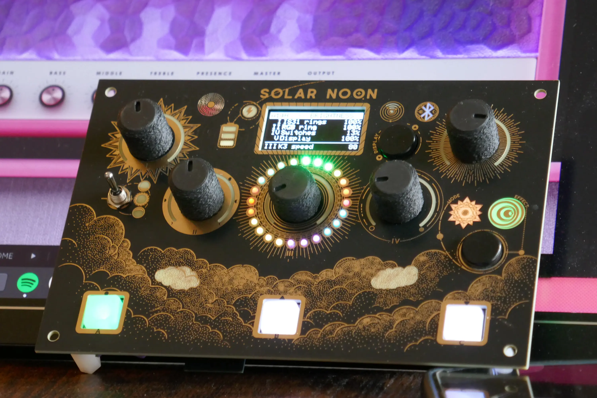

# SOLAR NOON 

  

A fully programmable MIDI controller pedal designed for musicians, creators, and live performers.

Firmware for a custom MIDI foot controller built around an ESP32: five knobs,
three footswitches, an OLED display, monochrome and RGB LED feedback, a
three-way switch, and a battery — talking to a DAW or plugin over USB or BLE
MIDI.

It was built to drive a guitar amp/cab/effects plugin (the screenshots and
default mappings below reflect that), but the firmware itself isn't tied to
any particular plugin: every control's MIDI mapping, label, and behavior is
declared in one data table (see [Documentation](#documentation)), and the
display is organized into independent "modes" so the same hardware can serve
entirely different purposes depending on what you load onto it.

## What it does

- **Five-knob parameter control** with two takeover behaviors (snap
  immediately, or wait for the physical knob to cross the stored value before
  taking over) so a knob never causes an audible jump when you switch pages or
  the DAW changes a value behind your back.
- **Three footswitches** for effect on/off and navigation, each with its own
  RGB feedback.
- **A three-way switch** for quick A/B/C-style selection, with its own
  position-indicator LEDs.
- **An OLED display** organized into independently-configurable *modes* (see
  below) plus a set of status/settings pages.
- **LED feedback throughout**: monochrome rings around the knobs, an RGB ring,
  and individually addressable status LEDs, all tied to either the current
  parameter values or your own custom logic.
- **USB or Bluetooth LE MIDI**, selectable at boot, with two-way sync — the
  controller reflects changes made from the DAW side, not just the ones it
  sends.
- **Persistent settings** (LED brightness, display contrast, layout, knob
  sensitivity…) stored on the device and adjustable from the on-device info
  pages, no companion app required.
- **Battery-aware**: voltage readout, low-battery warning, and automatic deep
  sleep to protect the cell.

## Display modes

The display is split into independently enabled "slots". Three are built in;
the remaining slots are free for you to fill with your own modes (the
[Getting started](GETTING_STARTED.md) guide walks through building one from
scratch).

| Mode | What it's for |
| --- | --- |
|  | **Parameter view** — the main per-effect control screen: five knobs and the three-way switch mapped to whichever effect's parameters are on the current page, with live feedback (label, value, LED rings) for each. Pages and parameters come straight from the same data table that drives MIDI, so nothing here needs to be hand-wired per effect. |
|  | **Effect grid** — an overview of every effect section at a glance: which ones are active, which one is selected, with quick navigation to jump straight to it in the parameter view. |
|  | **Other controls** — global, plugin-wide controls that don't belong to a specific effect (input/output gain, overall on/off, and the routing switches that decide which sections of the signal chain are active), laid out and operated independently of the per-effect pages. |

## Info pages

Alongside the display modes, a set of status and settings pages is always
reachable from the controller itself:

| Page | What it shows |
| --- | --- |
|  | **Status** — firmware version, battery voltage, USB/MIDI connection state, and uptime, at a glance. |
|  | **Bluetooth** — current connection mode (USB or BLE) and pairing status. |
|  | **Brightness** — per-element LED and display brightness (knob rings, RGB ring, switches, OLED contrast), plus the endless-encoder sensitivity, all adjustable on the spot and saved to flash. |
|  | **Layout** — the parameter view's page layout (a classic vertical list, a compact 5-column view, or a 2+3 grid), to match your screen-reading preference. |

## Documentation

- **[Getting started](GETTING_STARTED.md)** — customizing the firmware: the
  building blocks available to you (knobs, MIDI, LEDs, display modes), and a
  full worked example (the "Solar System" display mode) that ties them
  together. Start here if you want to add or change behavior.
- **API reference** — coming later; in the meantime, function signatures live
  in the headers (`leds_rgb.h`, `leds_mono.h`, `midi.h`, `knobs.h`,
  `switches.h`, `effects.h`, `display.h`).

## License

GPLv3 — see [LICENSE](LICENSE).
